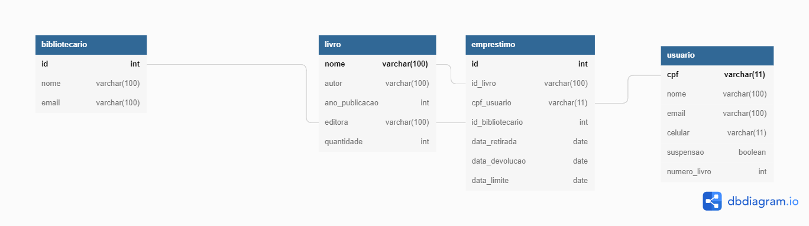

# Projeto-Biblioteca
Projeto de capacitação Let's Code.

O projeto visa a criação de um sistema de empréstimos de uma biblioteca.
<!--
## Como executar
-->
## Documentação
Diagrama de casos de uso da aplicação:

<!--
DER do banco de dados:

-->

## Colaboradores
* [Edson Valentim Hernandes](https://github.com/edsonhernandes)

* [Henrique Sartori Siqueira](https://github.com/h-ssiqueira)

* [Marina Linguanoto Gajego](https://github.com/Marina-Gajego)

* [Rhuan Gabriel de Oliveira Martins](https://github.com/RhuanGabriel1)

* [Willian Cesar Visicati](https://github.com/Willvizi)

## A modelagem foi baseada em:

# Projeto modificado pelo time Amarelo!

## 👨‍💻 Alunos:

- [Anicky Oliveira](https://www.linkedin.com/in/anicky-oliveira-250a75120/)
- [Enzo Goulart](https://www.linkedin.com/in/enzo-costa-58414620a/)
- [Hannah Freitas](https://www.linkedin.com/in/hannahcfreitas/)
- [Kayllane Gomes](https://www.linkedin.com/in/kayllane-gomes/)
- [Paula Fagundes](https://www.linkedin.com/in/paula-fagundes-669a211a3/)
- [Rejane Elisa](https://www.linkedin.com/in/rejane-elisa-ims-9063b055/)

## 🔃 Manipulação das Rotas de Bibliotecário:

| Método HTTP  | Endpoint                | Descrição                              |
| ------------ | ----------------------- | ------------------------------------   |
| GET          | `/librarian`            | Retorna todos os bibliotecarios        |
| GET          | `/librarian/student`    | Retorna todos os estudantes            |
| POST         | `/librarian`            | Cria/cadastra um novo bibliotecario    |
| POST         | `/librarian/student`    | Cria/cadastra um novo estudante        |
| PUT          | `/librarian/{id}`       | Altera informações de um bibliotecario |
| DELETE       | `/librarian/{id}`       | Deleta um bibliotecario                |

## 🔃 Manipulação das Rotas de Livros:

| Método HTTP  | Endpoint                | Descrição                            |
| ------------ | ----------------------- | ------------------------------------ |
| GET          | `/book`                 | Retorna todos os livros              |
| POST         | `/book`                 | Cria/cadastra um novo livro          |
| PUT          | `/book/{id}`            | Altera informações de um livro       |
| DELETE       | `/book/{id}`            | Deleta um livro                      |

## 🔃 Manipulação das Rotas de Empréstimo:

| Método HTTP  | Endpoint                | Descrição                            |
| ------------ | ----------------------- | ------------------------------------ |
| GET          | `/loan`                 | Retorna todos os empréstimos         |
| POST         | `/loan`                 | Cria/cadastra um novo empréstimo     |
| PUT          | `/loan/{id}`            | Altera informações de um empréstimo  |
| DELETE       | `/loan/{id}`            | Deleta um empréstimo                 |

## 🚧 Melhorias para o futuro (Em construção):

* Ainda estamos inserindo a rota de login com JWT
* Adicionar migrations com flyway.
* Implementar o front-end na aplicação.
